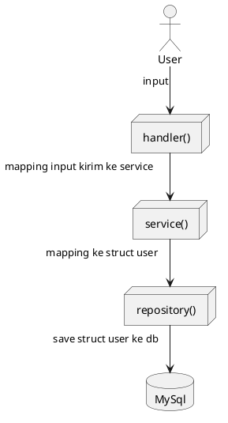
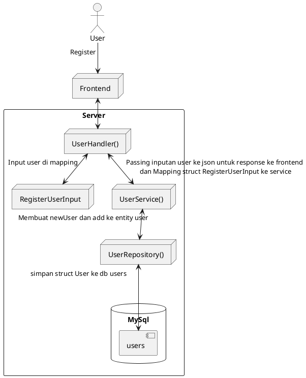

# Overall

- input ->
- handler (mapping input dan kirim ke service) ->
- service (mapping ke struct user) ->
- repository (save struct user ke db) ->
- db\
  |

```plantuml
@startuml
actor "User" as user
node "handler()" as handler
node "service()" as service
node "repository()" as repo
database "MySql" as db

user "input" --> handler
handler "mapping input kirim ke service" --> service
service "mapping ke struct user" --> repo
repo "save struct user ke db" --> db
@enduml
```

|

## Register User

```plantuml
@startuml
actor "User" as user
node "Frontend" as ui

rectangle "Server" {
    node "RegisterUserInput" as input
    node "UserHandler()" as handler
    node "UserService()" as service
    node "UserRepository()" as repo
    database "MySql" {
    component "users" as tb {

        }
    }
}
user "Register" --> ui
ui <--> handler
handler "Input user di mapping" <--> input
handler "Passing inputan user ke json untuk response ke frontend\n dan Mapping struct RegisterUserInput ke service" <--> service
service "Membuat newUser dan add ke entity user" <--> repo
repo "simpan struct User ke db users" <---> tb

@enduml
```
