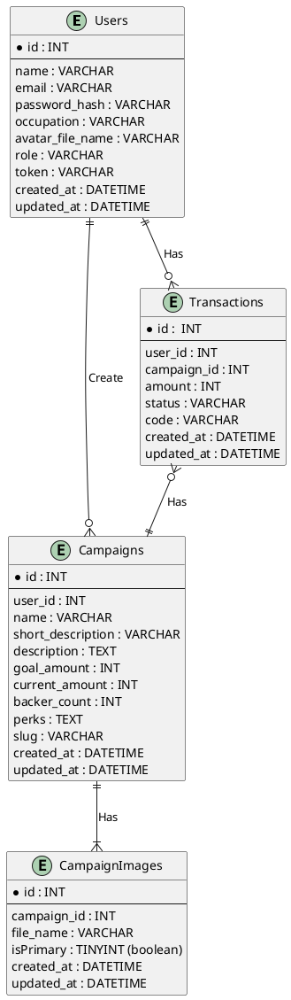

### Hasil analisis entity:

- Users
- Campaigns
- Campaign Images
- Transactions
\
\
\\

```plantuml
@startuml 
    entity Users {
        * id : INT
        --
        name : VARCHAR
        email : VARCHAR
        password_hash : VARCHAR
        occupation : VARCHAR
        avatar_file_name : VARCHAR
        role : VARCHAR
        token : VARCHAR
        created_at : DATETIME
        updated_at : DATETIME
    }

    entity Campaigns {
        * id : INT
        --
        user_id : INT
        name : VARCHAR
        short_description : VARCHAR
        description : TEXT
        goal_amount : INT
        current_amount : INT
        backer_count : INT
        perks : TEXT
        slug : VARCHAR
        created_at : DATETIME
        updated_at : DATETIME
     }

    entity CampaignImages {
        * id : INT
        --
        campaign_id : INT
        file_name : VARCHAR
        isPrimary : TINYINT (boolean)
        created_at : DATETIME
        updated_at : DATETIME
    }

    entity Transactions {
        * id :  INT
        --
        user_id : INT
        campaign_id : INT
        amount : INT
        status : VARCHAR
        code : VARCHAR
        created_at : DATETIME
        updated_at : DATETIME
    }

Users ||--o{ Campaigns : Create
Campaigns ||--|{ CampaignImages : Has
Users ||--o{ Transactions : Has
Transactions }o--|| Campaigns : Has

@enduml
```
